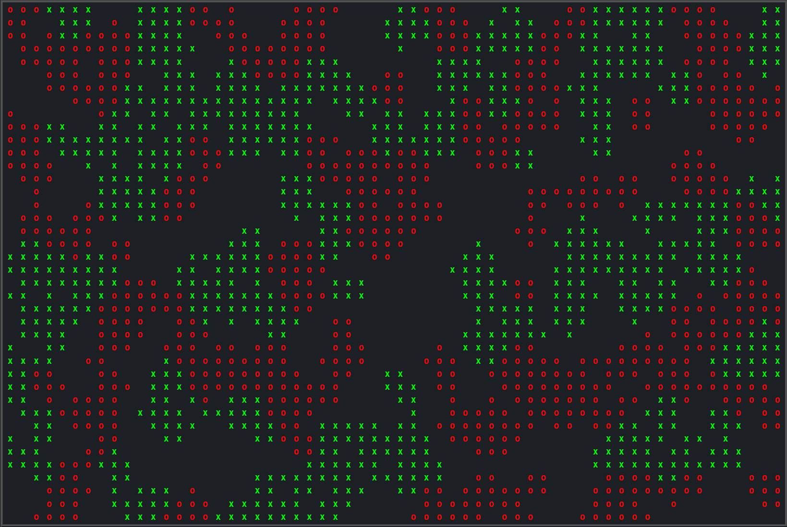

# **[Schelling's model of segregation](https://en.wikipedia.org/wiki/Schelling's_model_of_segregation)**

Progetto di corso per l'esame di **Programmazione Concorrente e Parallela su Cloud 2020/21**.

- Studente: **Giuseppe Arienzo**
- Matricola: **0522501062**
- Data di consegna: **01/06/2021**



## **Descrizione dell'implementazione**

La seguente implementazione si basa su **quattro passi di computazione** ben definiti

- [Divisione della matrice tra i processi coinvolti](#divisione-della-matrice-tra-i-processi-coinvolti)
- [Calcolo della soddisfazione degli agenti](#calcolo-della-soddisfazione-degli-agenti)
- [Assegnazione degli slot liberi](#assegnazione-degli-slot-liberi)
- [Spostamento degli agenti insoddisfatti](#spostamento-degli-agenti-insoddisfatti)
- [Aggregazione dei risultati e presentazione](#aggregazione-dei-risultati-e-presentazione)

### **Divisione della matrice tra i processi coinvolti**

Per dividere il carico di lavoro tra i vari processi è stato inizialmente valutata la possibilità di dividere la matrice in modo perfettaente equo tra questi ultimi, andando cioè a valutare divisioni composte da sotto sezioni di righe. Successivamente si è però notato che tale soluzione creava un notevo dispendio di tempo di computazione, che rendeva vano ogni miglioramento dovuto all distribuzione più equa deglia genti, si è per questo motivo optato per una soluzione più classica dividendo la matrice per righe, in questo modo nel caso pessimo uno o più agenti gestiscono **COLLUMS** agenti in più rispetto agli altri.

La divisione effettiva viene infine realizzata tramite l'utilizzo di una **ScatterV**:

```c  
MPI_Scatterv(i_mat, data.sec_size, data.sec_disp, MPI_CHAR, data.sub_mat, data.sec_size[rank], MPI_CHAR, MASTER, MPI_COMM_WORLD);
```

ed il codice che si occupa del calcolo delle grandezze necessarie alla divisione è il seguente:

```c
void calcSizes(int wd_size, Data data) {
    int section = ROWS / (wd_size);
    int difference = ROWS % (wd_size);

    if (wd_size >= 2)
        for (int i = 0; i < wd_size; i++) {
            data.sec_size[i] = i < difference ? (section + 1) * COLUMNS : section * COLUMNS;
            data.sec_gt_size[i] = data.sec_size[i];
            data.sec_gt_disp[i] = i == 0 ? 0 : data.sec_gt_disp[i - 1] + data.sec_gt_size[i - 1];
            data.sec_size[i] += ((i == 0) || (i == wd_size - 1)) ? COLUMNS : COLUMNS * 2;

            if (i == 0) {
                data.sec_disp[i] = 0;
            } else if (i == wd_size - 1)
                data.sec_disp[i] = (ROWS * COLUMNS) - data.sec_size[i];
            else {
                data.sec_disp[i] = data.sec_disp[i - 1] + data.sec_size[i - 1] - (COLUMNS * 2);
            }
        }
    else {
        data.sec_size[0] = ROWS * COLUMNS;
        data.sec_disp[0] = 0;
    }
}
```

é importante notare come la seguente funzione si occupa anche del calcolo delle grandezze necessarie alle successive operationi di gather con lo scopo riunire tutte le sotto matrici e presentare il risultato finale. Tutti questi valori vengono inoltre conservati in una struttura dati **Data** che contiene tutti i dati necessari alla computazione per ogni processo, in particolare per quanto riguarda i dati relativi ai displacement e le section size, tutti i processi dispongono di tutti i dati, questo per evitare inutili e costose operazioni di **comunicazione**:

```c
typedef struct {
    //Assigned start and finish submatrix
    int r_start;
    int r_finish;

    //Assigned submatrix
    char *sub_mat;

    //Number of assigned empty locations and locations
    int n_my_empty;
    int *my_emp_loc;

    //Information for the subdivision scatter
    int *sec_size;
    int *sec_disp;

    //Information for the subdivision gather
    int *sec_gt_size;
    int *sec_gt_disp;
} Data;
```

### **Calcolo della soddisfazione degli agenti**

Il calcolo della soddisfazione è stato effettuato tramite la funzione **calcSat** che data la posizione di un agente identifica il tipo di posizione in cui si trova (Angolo, Bordo o Centro) e procede al calcolo della soddisfazione tramite la seguente formula:

$$\frac{neigh}{100}*mykind$$

Dove ***neigh*** indica la grandezza del vicinato del agente preso in esame (3 per gli angoli e 5 per i bordi, 8 per gli agenti centrali) e ***mykind*** il numero di agenti del vicinato appartenenti alla stessa specie.

```c
int calcSat(int id, Data data, int rank) {
    //Calculate the satisfaction of an agent
    int neigh = 0, my_kynd = 0;
    int rowS = data.sec_size[rank] / COLUMNS;
    int rowS_index, col_index;

    convertIndex(id, &rowS_index, &col_index);

    if (rowS_index == 0)
        if (col_index == 0)
            satCorner(id, data, &neigh, &my_kynd, 0);  //Upper left corner
        else if (col_index == COLUMNS - 1)
            satCorner(id, data, &neigh, &my_kynd, 1);  //Upper right corner
        else
            satEdge(id, data, &neigh, &my_kynd, 0);  //Upper edge

    else if (rowS_index == rowS - 1)
        if (col_index == 0)
            satCorner(id, data, &neigh, &my_kynd, 2);  //Lower left corner
        else if (col_index == COLUMNS - 1)
            satCorner(id, data, &neigh, &my_kynd, 3);  //Lower right corner
        else
            satEdge(id, data, &neigh, &my_kynd, 3);  //Lower edge

    else if (col_index == 0 && rowS_index > 0 && rowS_index < rowS - 1)
        satEdge(id, data, &neigh, &my_kynd, 1);  //Left edge

    else if (col_index == COLUMNS - 1 && rowS_index > 0 && rowS_index < rowS)
        satEdge(id, data, &neigh, &my_kynd, 2);  //Right edge
    else
        satCenter(id, data, &neigh, &my_kynd);  //Center

    float perc = (100 / (float)neigh) * my_kynd;
    return perc >= SAT_THRESHOLD;
}
```

### **Assegnazione degli slot liberi**

Gli slot liberi all'interno della matrice vengono calcolati in modo distribuito tramite l'utilizzo di una **All_Gather**, in sostanza ogni processo procede a identificare gli slot liberi presenti nella propria sottomatrice, spazi che vengono poi aggregati e ridistribuiti.

Successivamente gli slot indetificati vengono assegnati ai singoli processi, questo avviene, con lo scopo di limitare al minimo le comunicazioni, tramite una funzione di ***shuffle*** che "disordina" il vettore in modo da randomizzare il modo in cui gli slot vengono assegnati, successicamente i processi prendono i primi **n_empty/world_size elementi** si è deciso di utilizzare questo metodo di assegnazioni degli slot liberi per due motivi:

* **Riduzione delle comunicazioni e distribuzione del carico:** Essendo ogni processo in grado di calcolare i propri slot liberi che utilizzerà per muovere i propri agenti insoddisfatti, non è necessario un processo che si accolli tale onere, in questo modo i processi restano sincronizzati per tutta l'esecuzione del codice, oltre che ridurre tutte quelle comunicazioni che sarebbero state necessarie per comunicare le posizioni.
* **Estetica della soluzione:** L'algoritmo di assegnazione scelto "spreca" consciamente alcune posizioni vuote (nel caso pessimo ***world_size - 1***) in quanto un assegnazione non omogenea creerebbe matrici in cui la parte alta è più popolata di quella bassa (nel caso in cui vengano assegnate più posizioni a processi con rank più basso).

```c
int calcEmptySlots(Data data, int *my_emp_loc, int rank, int wd_size, int n_itc) {
    //Locate all empty locations in submatrices and associates them
    int empty_tot = 0;
    int vet_siz[wd_size];
    int vet_disp[wd_size];

    // Find free locations in the local sub-matrix
    int *vet_emp = malloc(sizeof(int) * (data.r_finish - data.r_start));
    int n_my_emp = 0;
    for (int i = data.r_start; i <= data.r_finish; i++) {
        if (data.sub_mat[i] == ' ') {
            vet_emp[n_my_emp] = data.sec_disp[rank] + i;
            n_my_emp++;
        }
    }

    //Gather of global free locations
    MPI_Allgather(&n_my_emp, 1, MPI_INT, vet_siz, 1, MPI_INT, MPI_COMM_WORLD);
    for (int i = 0; i < wd_size; i++) {
        empty_tot += vet_siz[i];
        vet_disp[i] = i == 0 ? 0 : vet_disp[i - 1] + vet_siz[i - 1];
    }
    int *emp_slots = malloc(sizeof(int) * empty_tot);
    MPI_Allgatherv(vet_emp, n_my_emp, MPI_INT, emp_slots, vet_siz, vet_disp, MPI_INT, MPI_COMM_WORLD);

    //Randomizes the array of free locations
    srand(ASSIGN_SEED + n_itc);
    shuffle(emp_slots, empty_tot);

    //Assignment of free locations to processes
    data.n_my_empty = empty_tot / wd_size;
    int k = rank * data.n_my_empty;
    for (int i = 0; i < data.n_my_empty; i++) {
        my_emp_loc[i] = emp_slots[k];
        k++;
    }

    free(emp_slots);
    free(vet_emp);
    return data.n_my_empty;
}
```

### **Spostamento degli agenti insoddisfatti**

### **Aggregazione dei risultati e presentazione**

## **Note sull'implementazione**

### **Compilazione**

### **Esecuzione**

## **Risultati**

I={some value}
P={some value}

### K = {some value}

#### Scalabilità debole N={some value}

#### Scalabilità forte N={some value}

### K/2 = {some value}

#### Scalabilità debole N={some value}

#### Scalabilità forte N={some value} 

### 2K = {some value}

#### Scalabilità debole N={some value}

#### Scalabilità forte N={some value} 

## **Descrizione dei risultati**

## **Conclusioni**