# **[Schelling's model of segregation](https://en.wikipedia.org/wiki/Schelling's_model_of_segregation)**

Progetto di corso per l'esame di **Programmazione Concorrente e Parallela su Cloud AC 2020/21** curriculum **Cloud Computing**.

- Studente: **Giuseppe Arienzo**.
- Matricola: **0522501062**.
- Data di consegna: **01/06/2021**.

___

## **Sommario** ##


  - [**Descrizione del problema:**](#descrizione-del-problema)
    - [**Segregazione spaziale:**](#segregazione-spaziale)
    - [**Modello di Schelling:**](#modello-di-schelling)
  - [**Descrizione dell'implementazione**](#descrizione-dellimplementazione)
    - [**Divisione della matrice tra i processi coinvolti**](#divisione-della-matrice-tra-i-processi-coinvolti)
    - [**Calcolo della soddisfazione degli agenti**](#calcolo-della-soddisfazione-degli-agenti)
    - [**Assegnazione degli slot liberi**](#assegnazione-degli-slot-liberi)
    - [**Spostamento degli agenti insoddisfatti**](#spostamento-degli-agenti-insoddisfatti)
    - [**Aggregazione dei risultati e presentazione**](#aggregazione-dei-risultati-e-presentazione)
  - [**Note sull'implementazione**](#note-sullimplementazione)
    - [**Compilazione**](#compilazione)
    - [**Esecuzione**](#esecuzione)
  - [**Benchmarking**](#benchmarking)
    - [**Risultati ottenuti**](#risultati-ottenuti)
      - [**Scalabilità forte:**](#scalabilità-forte)
      - [**Scalabilità debole:**](#scalabilità-debole)
    - [**Descrizione dei risultati:**](#descrizione-dei-risultati)
  - [**Correttezza**](#correttezza)
  - [**Conclusioni**](#conclusioni)

___

## **Descrizione del problema:**

La seguente implementazione si pone l'obbiettivo di realizzare una simulazione del modello di **segregazione di Schelling**, tramite l'uso del linguaggio **C** e della libreria **MPI (Message Passing Interface).**

### **Segregazione spaziale:** ###

La **segregazione residenziale** (o **spaziale**) è un fenomeno sociale che consiste nell'occupazione separata, da parte di diversi gruppi umani, di aree spaziali collocate all'interno di determinati orizzonti geopolitici, come un'area urbana, una località, una regione, uno stato.

### **Modello di Schelling:** ###

A cavallo tra gli anni **60** e **70** del **Novecento**, l'economista **Thomas Schelling**, condusse una serie di studi con cui si proponeva di indagare l'influenza delle preferenze individuali nel determinare la segregazione spaziale;

Schelling utilizzò un modello a più agenti intelligenti: il cui movimento da una casella all'altra era condizionato, ogni volta, dall' **"infelicità"** della posizione occupata, a sua volta legato al colore delle pedine più vicine: tali modelli hanno mostrato che è sufficiente che le persone coltivino una blanda preferenza di qualche tipo (ad esempio, etnica, sociale, culturale, ecc.) perché l'effetto di scelte individuali ispirate da tali preferenze debolissime si componga in un fenomeno complessivo di totale segregazione.

<p style="text-align: center;"></p>

## **Descrizione dell'implementazione**

La seguente implementazione si basa su **cinque passi di computazione** ben definiti, che permettono di dividere la matrice in parti ragionevolmente uguali tra i processi, **indentificare gli agenti insoddisfatti** e di ****spostarli**** in determinate posizioni libere sparse sulla matrice.

### **Divisione della matrice tra i processi coinvolti**

Per dividere il carico di lavoro tra i vari processi è stato inizialmente valutata la possibilità di dividere la matrice in modo perfettamente equo tra questi ultimi, andando cioè a valutare divisioni composte da sotto sezioni di righe. Successivamente si è però notato che tale soluzione creava un notevole spreco dal punto di vista del tempo di computazione, che rendeva vano ogni miglioramento dovuto alla distribuzione più equa degli agenti, si è per questo motivo optato per una soluzione più "classica" dividendo la matrice per righe, in questo modo nel caso pessimo uno o più agenti gestiscono **COLLUMS** agenti in più rispetto agli altri.

La divisione effettiva viene infine realizzata tramite l'utilizzo di una **ScatterV**:

```c  
MPI_Scatterv(i_mat, data.sec_size, data.sec_disp, MPI_CHAR, data.sub_mat, data.sec_size[rank], MPI_CHAR, MASTER, MPI_COMM_WORLD);
```

Tramite una serie dei valori di **Section_Size** e **Displacement** che vengono calcolati nella funzione **calcSizes:**

```c
void calcSizes(int wd_size, Data data) {
    int section = ROWS / (wd_size);
    int difference = ROWS % (wd_size);

    if (wd_size >= 2)
        for (int i = 0; i < wd_size; i++) {
            data.sec_size[i] = i < difference ? (section + 1) * COLUMNS : section * COLUMNS;
            data.sec_gt_size[i] = data.sec_size[i];
            data.sec_gt_disp[i] = i == 0 ? 0 : data.sec_gt_disp[i - 1] + data.sec_gt_size[i - 1];
            data.sec_size[i] += ((i == 0) || (i == wd_size - 1)) ? COLUMNS : COLUMNS * 2;

            if (i == 0) {
                data.sec_disp[i] = 0;
            } else if (i == wd_size - 1)
                data.sec_disp[i] = (ROWS * COLUMNS) - data.sec_size[i];
            else {
                data.sec_disp[i] = data.sec_disp[i - 1] + data.sec_size[i - 1] - (COLUMNS * 2);
            }
        }
    else {
        data.sec_size[0] = ROWS * COLUMNS;
        data.sec_disp[0] = 0;
    }
}
```

> **Nota:** la seguente funzione si occupa anche del calcolo delle grandezze necessarie alle successive operazioni di **Gather** con lo scopo riunire tutte le sotto matrici e presentare il risultato finale.

Tutti questi valori vengono inoltre conservati in una struttura dati **Data** che contiene tutto ciò che è necessario alla computazione per ogni processo, in particolare per quanto riguarda le informazioni relative ai **displacements** e alle **section sizes**, sono distribuite in tutti i processi, questo per evitare inutili e costose operazioni di **comunicazione aggiuntive:**

```c
typedef struct {
    //Assigned start and finish submatrix
    int r_start;
    int r_finish;

    //Assigned submatrix
    char *sub_mat;

    //Number of assigned empty locations and locations
    int n_my_empty;
    int *my_emp_loc;

    //Information for the subdivision scatter
    int *sec_size;
    int *sec_disp;

    //Information for the subdivision gather
    int *sec_gt_size;
    int *sec_gt_disp;
} Data;
```

### **Calcolo della soddisfazione degli agenti**

Il calcolo della soddisfazione è stato effettuato tramite la funzione **calcSat** che data la posizione di un agente identifica il tipo di posizione di quest'ultimo (**Angolo**, **Bordo** o **Centro**) e procede al calcolo della soddisfazione tramite la seguente formula:

<p style="text-align: center;"><b> (neigh/100)*mykind </b></p>

Dove ***neigh*** indica il numero di celle che circondano l'agente (**3 per gli angoli**, **5 per i bordi** e **8 per gli agenti centrali**) e ***mykind*** il numero di agenti nel vicinato appartenenti alla stessa specie.

Il valore per cui un agente viene ritenuto soddisfatto viene definito tramite la costante **SAT_THRESHOLD**, di default questo valore è impostato a **33%** ma aumentandolo gli agenti si aggregano sempre di più ([**vedi prova di correttezza**](#correttezza)), in ogni caso, per garantire una buona efficienza si consiglia di non superare il **40%** di soddisfazione richiesta, infatti in tal caso sarà necessario, se si vuole ottenere una matrice completamente soddisfatta, andare ad aumentare il numero di iterazioni consentite tramite la costante **N_ITERACTION**

### **Assegnazione degli slot liberi**

Gli slot liberi all'interno della matrice vengono identificati all'inizio di ogni iterazione in modo distribuito tramite l'utilizzo di una **All_Gather**, in sostanza ogni processo procede a identificare gli slot liberi presenti nella propria sottomatrice, che vengono poi aggregati e ridistribuiti.

Successivamente gli slot indetificati vengono assegnati ai singoli processi. Questo avviene, con lo scopo di limitare al minimo le comunicazioni, tramite una funzione di ***shuffle*** che "disordina" il vettore in modo da randomizzare il modo in cui gli slot vengono assegnati, successicamente i processi prendono i primi **n_empty/world_size** elementi.

```c
void shuffle(int *vet, int length) {
    //Randomizes the position of values in a vector
    for (int i = length - 1; i > 0; i--) {
        // Pick a random index from 0 to i
        int j = rand() % (i + 1);

        // Swap arr[i] with the element at random index
        swap(&vet[i], &vet[j]);
    }
}
```

Si è deciso di utilizzare questo metodo di assegnazioni degli slot liberi per due motivi:

- **Riduzione delle comunicazioni e distribuzione del carico:** Essendo ogni processo in grado di calcolare i propri slot liberi, che utilizzerà per muovere i propri agenti insoddisfatti, in modo indipendente non è necessario un processo che si accolli tale onere, in questo modo i processi restano sincronizzati e "alla pari" per tutta l'esecuzione del codice, oltre ad andare a ridurre tutte quelle comunicazioni che sarebbero state necessarie per comunicare le assegnazioni.
- **Estetica della soluzione:** L'algoritmo di assegnazione scelto **"spreca"** consciamente alcune posizioni vuote (nel caso pessimo ***world_size - 1***) in quanto un assegnazione non omogenea creerebbe matrici in cui la parte alta è più popolata di quella bassa (nel caso in cui vengano assegnate più posizioni a processi con rank più basso).

La funziona che si occupa di tutto questo è **calcEmptySlots:**

```c
int calcEmptySlots(Data data, int *my_emp_loc, int rank, int wd_size, int n_itc) {
    //Locate all empty locations in submatrices and associates them
    int empty_tot = 0;
    int vet_siz[wd_size];
    int vet_disp[wd_size];

    // Find free locations in the local sub-matrix
    int *vet_emp = malloc(sizeof(int) * (data.r_finish - data.r_start));
    int n_my_emp = 0;
    for (int i = data.r_start; i <= data.r_finish; i++) {
        if (data.sub_mat[i] == ' ') {
            vet_emp[n_my_emp] = data.sec_disp[rank] + i;
            n_my_emp++;
        }
    }

    //Gather of global free locations
    MPI_Allgather(&n_my_emp, 1, MPI_INT, vet_siz, 1, MPI_INT, MPI_COMM_WORLD);
    for (int i = 0; i < wd_size; i++) {
        empty_tot += vet_siz[i];
        vet_disp[i] = i == 0 ? 0 : vet_disp[i - 1] + vet_siz[i - 1];
    }
    int *emp_slots = malloc(sizeof(int) * empty_tot);
    MPI_Allgatherv(vet_emp, n_my_emp, MPI_INT, emp_slots, vet_siz, vet_disp, MPI_INT, MPI_COMM_WORLD);

    //Randomizes the array of free locations
    srand(ASSIGN_SEED + n_itc);
    shuffle(emp_slots, empty_tot);

    //Assignment of free locations to processes
    data.n_my_empty = empty_tot / wd_size;
    int k = rank * data.n_my_empty;
    for (int i = 0; i < data.n_my_empty; i++) {
        my_emp_loc[i] = emp_slots[k];
        k++;
    }

    free(emp_slots);
    free(vet_emp);
    return data.n_my_empty;
}
```

### **Spostamento degli agenti insoddisfatti**

Una volta assegnate le posizioni vuote ai singoli processi, ognuno di essi identifica i primi **n_my_empty** (numero di celle vuote a disposizione) agenti insoddisfatti che saranno candidati allo spostamento, per ognuno di questi agenti vengono calcolate e salvate tre informazioni:

- **Id_agent:** Che rappresenta la cella di "arrivo" del agente in movimento (una delle celle vuote assegnate al processo).
- **id_reset:** Che rappresenta la cella di "partenza" del agente in spostamento e che quindi dovra essere azzerata.
- **vl_agent:** Che rappresenta la tipologia dell'agente che si sta spostando.

Tutte queste informazioni vengono successivamente aggregate all'interno della struttura dati **Move** di cui array rappresenta tutte i movimenti che un determinato processo sta eseguendo.

```c
typedef struct {
    //Arrival index of the moving agent
    int id_agent;

    //Starting index of the moving agent
    int id_reset;

    //Type of agent on the move
    char vl_agent;
} Move;
```

Una volta che ogni processo ha popolato il proprio vettore di movimenti (nel caso in cui non voglia fare spostamenti setta tutti valori a **-1,-1,n**) viene eseguita un operazione di **Allgather**, cosi facendo tutti i processi possiederanno un array **Move** che contiene tutti gli spostamenti in atto durante l'iterazione corrente e, singolarmente scorrend questo vettore, saranno in grado di aggiornare le proprie sottomatrici **resettando** o **popolandole** celle.

La funzione che si occupa di questo è **Move:**

```c
void move(Data data, Move *my_moves, MPI_Datatype move_data_type, int wd_size, int rank) {
    //Carries out the movement operations of the agents
    int sec_size[wd_size];
    int sec_disp[wd_size];

    for (int i = 0; i < wd_size; i++) {
        sec_size[i] = data.n_my_empty;
        sec_disp[i] = i == 0 ? 0 : sec_disp[i - 1] + sec_size[i - 1];
    }

    Move *moves = malloc(sizeof(Move) * data.n_my_empty * wd_size);
    MPI_Allgatherv(my_moves, data.n_my_empty, move_data_type, moves, sec_size, sec_disp, move_data_type, MPI_COMM_WORLD);

    for (int i = 0; i < data.n_my_empty * wd_size; i++) {
        if (moves[i].id_agent != -1) {
            if (calcMembership(data, rank, moves[i].id_agent)) {
                data.sub_mat[moves[i].id_agent - data.sec_disp[rank]] = moves[i].vl_agent;
            }
            if (calcMembership(data, rank, moves[i].id_reset)) {
                data.sub_mat[moves[i].id_reset - data.sec_disp[rank]] = ' ';
            }
        }
    }
    free(moves);
}
```

### **Aggregazione dei risultati e presentazione**

Com'è stato precedentemente illustrato il massimo numero di iterazioni consentite viene definito dalla costante **N_ITERACTION**, tale valore è però solo un valore indicativo in quanto l'implementazione, effettuando una **All_Reduce** del numero di agenti insoddisfatti identificati in ogni iterazione è in grado di fermare, se occorre, la computazione in modo anticipato.

> **Nota:** si è notate che l'implementazione è in grado di soddisfare completamente (con una soglia di soddisfazione del 33%) anche matrici molto grandi in circa 40 iterazioni.

```c
//Check if all processes have finished their movements
int tot_over;
MPI_Allreduce(&is_over, &tot_over, 1, MPI_INT, MPI_SUM, MPI_COMM_WORLD);

return (tot_over == 0);
```

Infine al termine dell'ultima iterazione le sottomatici vengono infine aggregate tramite l'uso di una gather nel processo 0, che rappresenta il master della computazione, che si occuperà infine della stampa del risultato.

```c
void gatherResult(Data data, int rank, char *i_mat) {
    //Gather results and save them to a file
    char *section = malloc(sizeof(char) * data.sec_gt_size[rank]);
    int k = 0;
    for (int i = data.r_start; i <= data.r_finish; i++) {
        section[k] = data.sub_mat[i];
        k++;
    }
    MPI_Gatherv(section, data.sec_gt_size[rank], MPI_CHAR, i_mat, data.sec_gt_size, data.sec_gt_disp, MPI_CHAR, MASTER, MPI_COMM_WORLD);

    free(section);
}
```


  <head>
    <script type="text/javascript" src="https://www.gstatic.com/charts/loader.js"></script>
    <script type='text/javascript'>
      google.charts.load('current', {'packages':['annotationchart']});
      google.charts.setOnLoadCallback(drawChart);

      function drawChart() {
        var data = new google.visualization.DataTable();
        data.addColumn('date', 'Date');
        data.addColumn('number', 'Kepler-22b mission');
        data.addColumn('string', 'Kepler title');
        data.addColumn('string', 'Kepler text');
        data.addColumn('number', 'Gliese 163 mission');
        data.addColumn('string', 'Gliese title');
        data.addColumn('string', 'Gliese text');
        data.addRows([
          [new Date(2314, 2, 15), 12400, undefined, undefined,
                                  10645, undefined, undefined],
          [new Date(2314, 2, 16), 24045, 'Lalibertines', 'First encounter',
                                  12374, undefined, undefined],
          [new Date(2314, 2, 17), 35022, 'Lalibertines', 'They are very tall',
                                  15766, 'Gallantors', 'First Encounter'],
          [new Date(2314, 2, 18), 12284, 'Lalibertines', 'Attack on our crew!',
                                  34334, 'Gallantors', 'Statement of shared principles'],
          [new Date(2314, 2, 19), 8476, 'Lalibertines', 'Heavy casualties',
                                  66467, 'Gallantors', 'Mysteries revealed'],
          [new Date(2314, 2, 20), 0, 'Lalibertines', 'All crew lost',
                                  79463, 'Gallantors', 'Omniscience achieved']
        ]);

        var chart = new google.visualization.AnnotationChart(document.getElementById('chart_div'));

        var options = {
          displayAnnotations: true
        };

        chart.draw(data, options);
      }
    </script>
  </head>

  <body>
    <div id='chart_div' style='width: 900px; height: 600px;'></div>
  </body>


___

## **Note sull'implementazione**

L'implementazione mette a disposizione tre tipologie di output, selezionabili tramite il flag **OUTPUT_TYPE** presente nella parte iniziale del codice:

```c
#define OUTPUT_TYPE 0  //? 0 HTML output, 1 CLI output. 2 CLI reduced
```

- **HTML:** Formatta l'output in una pagina html che oltre alla matrice risultante e iniziale, mostra le impostazioni dell'esecuzione nonchè alcune statistiche sul tempo di computazione impiegato e il numero di iterazione effettuate.
- **CLI:** Mostra all'interno della linea di comando la matrice risultatente e la mastrice iniziale, nonchè il tempo di esecuzione e il numero di iterazioni svolte.
- **CLI_Reduced:** Mostra solamente il tempo di esecuzione totale e il numero di iterazioni svolte, si consiglia l'uso di questa modalità nel caso in cui si vogliano testare matrici particolamente grandi.

### **Compilazione**

Un esempio di comando di compilazione è il seguente:

```bash
mpicc Schellings_model.c -o Schellings_model.out
```

### **Esecuzione**

Prima di avviare l'esecuzione è possibile modificare le impostazioni di quest'ultima all'interno del codice sorgente:

```c
//* Outuput type
#define OUTPUT_TYPE 2  //? 0 HTML output, 1 CLI output. 2 CLI reduced

//*#region Computation settings
#define RANDOM_MATRIX 0   //? Choose between random (1) or static matrix(0)
#define ROWS 1000         //? Number of rows
#define COLUMNS 10        //? Number of columns
#define O_PERCENTAGE 33   //? Percentage of O agents
#define X_PERCENTAGE 33   //? Percentage of X agents
#define SAT_THRESHOLD 35  //? Percentage of satisfaction required
#define N_ITERACTION 100  //? Number of iteration calculated
#define ASSIGN_SEED 10    //? Seed for free location assignment
//#endregion
```

Esempio di comando di esecuzione:

```bash
mpirun --allow-run-as-root --mca btl_vader_single_copy_mechanism none -np 4 Schellings_model.out
```

___

## **Benchmarking**

Il benchmarking della soluzione è stato effettuato su un cluster di quattro macchine **m4.xlarge** per un totale di **16 vCPUs** e **16 Gb di RAM**. Sono stati effettuati in totale quattro test, per andare a valutare la **Strong** e la **Weak Scalability**, più nel dettaglio i test effettuati sono stati i seguenti:

- **Matrice 1000*1000:** su rispettivamente **1, 2, 4, 6, 8, 10, 12, 14, 16 vCPUs**, con **cinque ripetizioni ognuno**. Con lo scopo di valutare la **Strong Scalability.**
  
- **Matrice 2500*2500:** su rispettivamente **1, 2, 4, 6, 8, 10, 12, 14, 16 vCPUs**, con **cinque ripetizioni ognuno**. Con lo scopo di valutare la **Strong Scalability.**
  
- **Matrice 5000*5000:** su rispettivamente **1, 2, 4, 6, 8, 10, 12, 14, 16 vCPUs**, con **cinque ripetizioni ognuno**. Con lo scopo di valutare la **Strong Scalability.**
  
- **Matrice da 1000 colonne e 1000 righe a vCPUs:** su rispettivamente **1, 2, 4, 6, 8, 10, 12, 14, 16 vCPUs** per andare a valutare la **Weak Scalability.**

### **Risultati ottenuti**

Seguono i risultati ottenuti e i rispettivi valori di **SpeedUP.**

#### **Scalabilità forte:**

|               Matrice 1000 * 1000:             |                                              |
| :--------------------------------------------: | :------------------------------------------: |
| 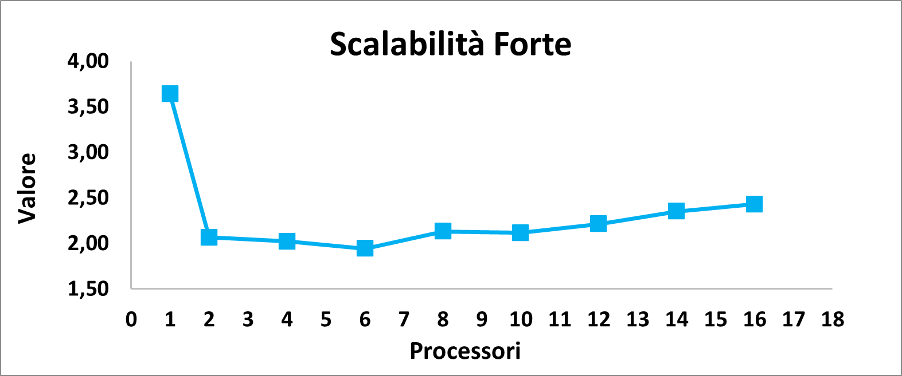       | 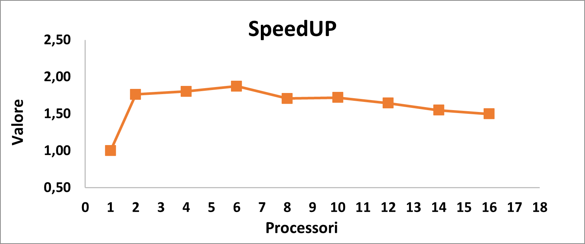    |

|               Matrice 2500 * 2500:             |                                              |
| :--------------------------------------------: | :------------------------------------------: |
| 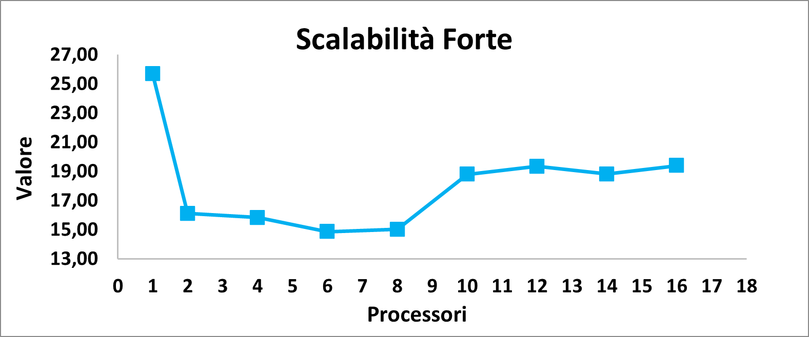       | 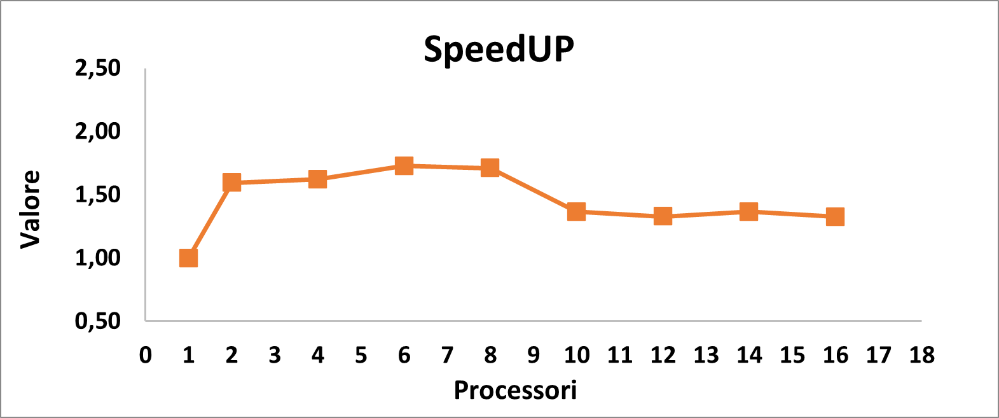    |

|               Matrice 5000 * 5000:             |                                              |
| :--------------------------------------------: | :------------------------------------------: |
| 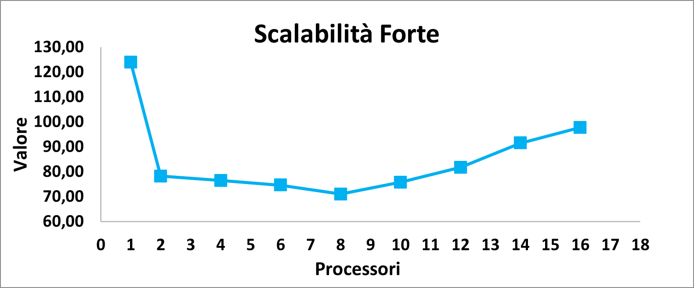       |     |

#### **Scalabilità debole:**

|               Matrice 1000 * 1000:             |
| :--------------------------------------------: |
| 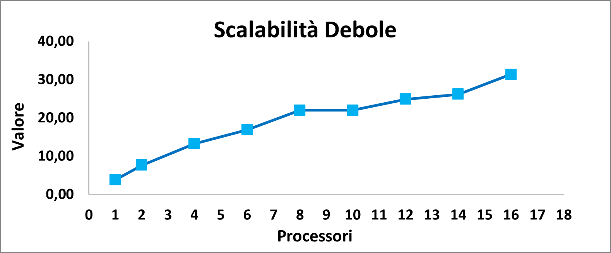             |

### **Descrizione dei risultati:**

I risultati ottenuti hanno mostrato come il passaggio alla computazione parallela porti un incremento significativo delle performance, che viene mantenuto tendenzialmente anche all'aumentare del numero di processi. Com'era però ragionevole aspettarsi, questo miglioramento si disperde man mano che il numero di **vCPUs** aumenta in quanto **l'overhead** dovuto alla comunicazione diventa più presente.

## **Correttezza**

la correttezza dell'algoritmo può essere valutata in principalemente grazie a due aspetti.

In primo luogo l'implementazione ricevuto in input una matrice costante e con numero di core costante restituisce sempre la stessa soluzione:

|           Prima Iterazione (4 Processi)        |        Seconda Iterazione (4 Processi)       |           Prima Iterazione (3 Processi)        |        Seconda Iterazione (3 Processi)       |
| :--------------------------------------------: | :------------------------------------------: | :--------------------------------------------: | :------------------------------------------: |
| 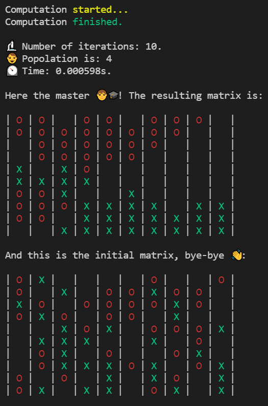          | 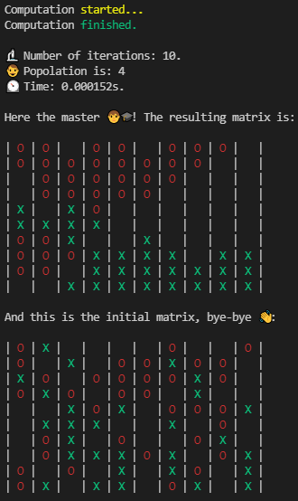        | 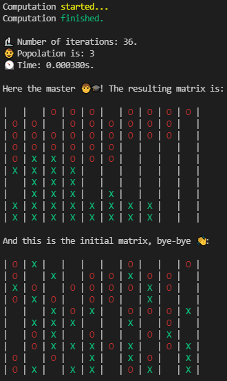          |         |

In secondo luogo è possibile apprezzare come la matrice da disordinata e caotica si riorganizza andando a creare dei gruppi ben definiti di agenti, che sono particolarmene evidenti per matrici molto grandi.

|          Matrice Finale (Sat. 33%)             |       Matrice Iniziale (Sat. 33%)            |
| :--------------------------------------------: | :------------------------------------------: |
|       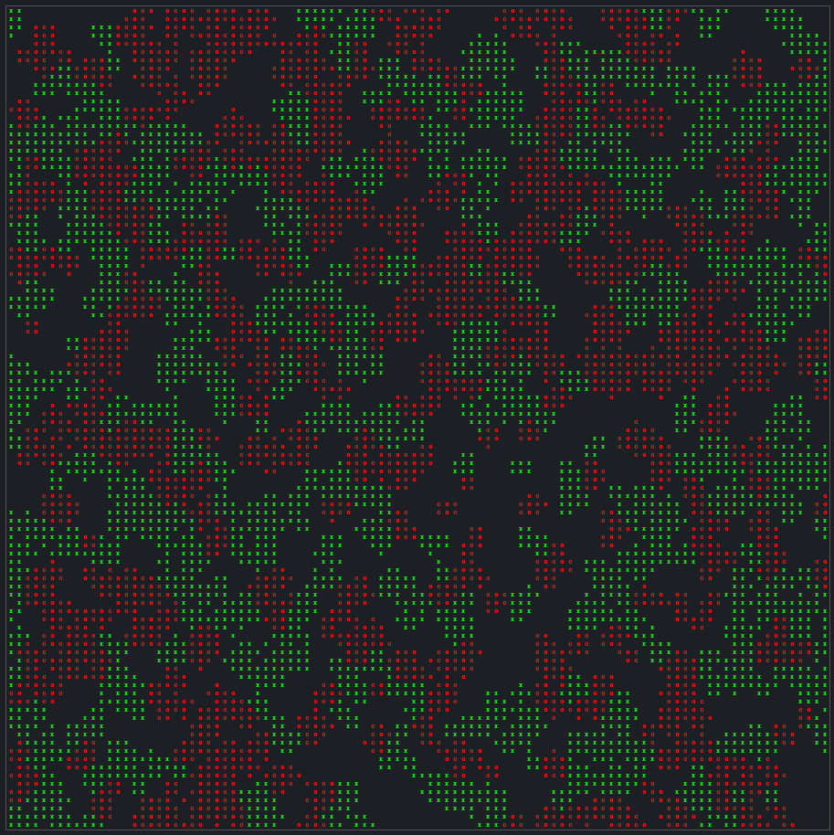       |      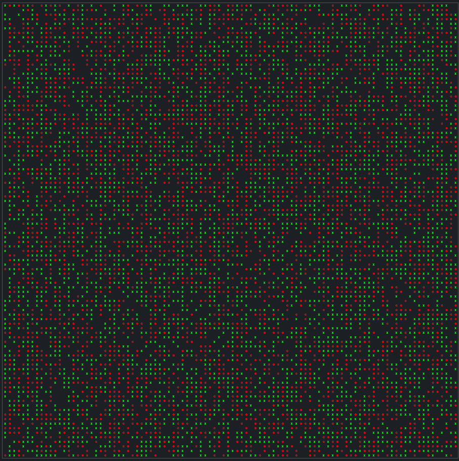      |

|          Matrice Finale (Sat. 40%)             |       Matrice Iniziale (Sat. 40%)            |
| :--------------------------------------------: | :------------------------------------------: |
|              |      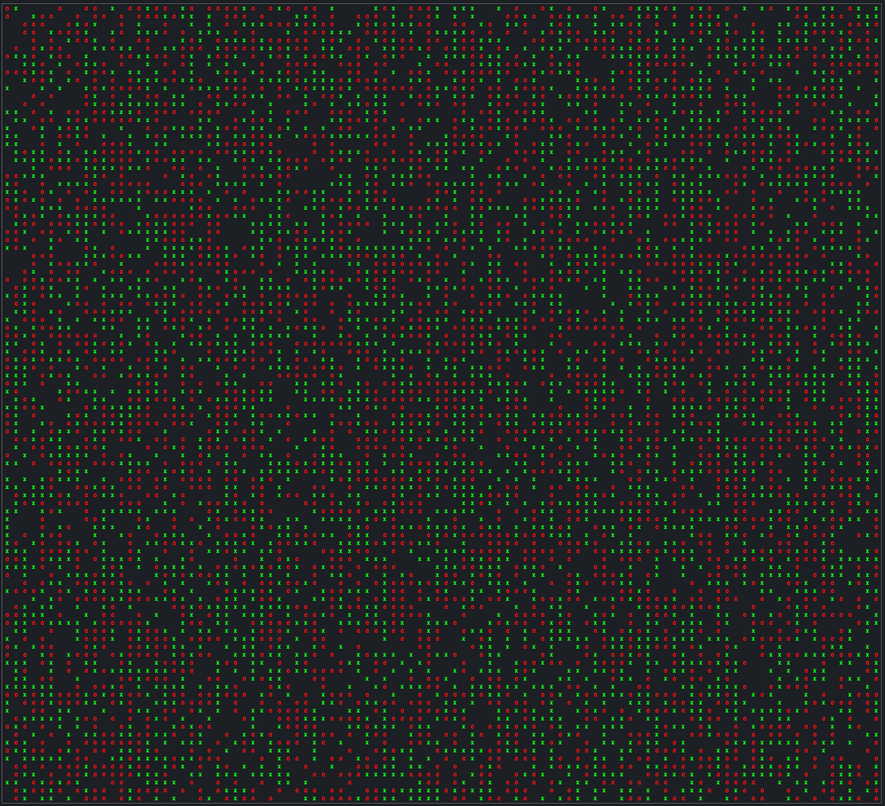      |

## **Conclusioni**

Concludendo l'implementazione presentata realizza una buona simulazione del modello di Schelling sfruttando la programmazione parallela. La scelta di non utilizzare la semplificazione del problema ha però ovviamente portato a un aumento della complessità e delle comunicazioni necessaria, portando a un inevitabile decadimento delle prestazioni, che però è un **trade off** accettabile che porta a un risultato più valido e fedele al modello.
